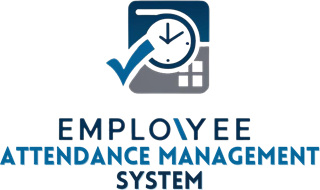

# 🏢 Emplo\Yee Attendance Management System

<p align="center">
  
</p>

Welcome to the **Emplo\Yee Attendance Management System** repository!  
This is my **sixth major project**, developed independently as part of my coursework at the **International Business-Information Academy Tuzla**, under the subject **Programming in Java**. The project demonstrates the integration of a modern Java application with UI features and database management.

## 📋 Project Overview

The **Emplo\Yee Attendance Management System** is a desktop application designed to simplify employee management for organizations. It provides features such as employee CRUD operations, role-based dashboards, bug reporting, and data encryption for enhanced security. The application is powered by **Java**, with a sleek UI using the **FlatLaf Look and Feel** library and MongoDB for database operations.

### 🌟 Key Features:
- **Role-based Dashboards**: Separate views for employees, managers, and admins.
- **Secure Authentication**: Password hashing using the `BCrypt` algorithm.
- **Bug Reporting System**: Employees can submit bug reports, which are stored for further action.
- **Employee CRUD Operations**: Administrators can manage employee records efficiently.
- **Modern UI**: Built with Swing and enhanced using the `FlatLaf` library.
- **MongoDB Integration**: Data is stored and retrieved using the MongoDB database.

---

## 🛠️ Dependencies

Below is the list of dependencies used in this project, along with their purposes and versions:

| **Dependency**            | **Description**                     | **Purpose**                                                           | **Version** |
|----------------------------|-------------------------------------|------------------------------------------------------------------------|-------------|
| `mongodb.driver.sync`      | MongoDB database driver             | Enables synchronous MongoDB CRUD operations.                          | 5.2.1       |
| `json`                     | JSON processing library             | Parses and generates JSON data for APIs and internal data handling.    | 20240303    |
| `slf4j.api`                | Logging API library                 | Provides standardized logging independent of specific implementations. | 2.0.16      |
| `ch.qos.logback.classic`   | Logging implementation for SLF4J    | Saves logs in various formats (files, console) for application monitoring. | 1.5.15  |
| `formdev.flatlaf`          | Modern Swing Look and Feel library  | Adds a modern, minimalist design to the application interface.         | 3.1.1       |
| `mindrot.jbcrypt`          | Password hashing library            | Hashes user passwords for secure authentication.                      | 0.4         |
| `swinglabs.swingx.all`     | Extended Swing UI components        | Enhances UI with advanced table, graphical components, and features.  | 1.6.4       |
| `google.code.gson`         | JSON library by Google              | Serializes and deserializes Java objects to/from JSON.                 | 2.11.0      |

---

## 📂 Project Structure

The project is organized into various modules to ensure clear separation of concerns. Below are key components:

### Controllers
- **`src/controllers/MongoDBController`**: Handles database operations, including CRUD functions and connection to the MongoDB database.
- **`src/controllers/EmployeeService`**: Manages business logic related to employees, including processing CRUD operations.

### Models
- **`src/models/Employee`**: Represents the employee entity with attributes like name, role, and credentials.
- **`src/models/BugReport`**: Represents the bug report entity submitted by employees.

### Scripts
- **`src/scripts/HashPasswordScript`**: Script for securely hashing passwords using the BCrypt algorithm.
- **`src/scripts/InsertDocumentsScript`**: Script for populating the MongoDB database with initial data.

### Views
- **`src/views/LoginForm`**: Provides a secure login interface for all users.
- **`src/views/CustomSplashScreen`**: Displays a custom splash screen during application startup.
- **`src/views/EmployeeDashboard`**: Dashboard for employees to view tasks, report bugs, and view personal details.
- **`src/views/ManagerDashboard`**: Dashboard for managers to oversee employees and review bug reports.
- **`src/views/AdminDashboard`**: Admin dashboard for managing users, performing CRUD operations, and monitoring the system.

---

## 💻 Getting Started

Follow these steps to run the project on your local machine:

## Requirements

- **Java**: OpenJDK 23.0.1 (recommended) or higher
- **IDE**: IntelliJ IDEA 2024.2.5 (recommended) or any other Java IDE  
- **Database**: MongoDB server (ensure it is running locally or provide a valid connection string)  

2. **Setup**:
   - Clone the repository:
     ```bash
     git clone https://github.com/demirhalilbasic/employee-ams.git
     ```
   - Open the project in IntelliJ IDEA.
   - Ensure all dependencies are included in the `pom.xml` (if using Maven) or `build.gradle` (if using Gradle). You can also add them through IntelliJ interface (Right upper corner, IDE and Project Settings -> Project Structure -> Modules -> Dependencies -> Add -> Library -> From Maven, and then use Search bar to lookup for required ones)

3. **Database Configuration**:
   - Set up MongoDB and create a database named `attendance_system`, as well as collections `employees` and `bug_reports`.
   - Populate the database using the `InsertDocumentsScript`.
   - Hash the passwords using `HashPasswordScript`.

4. **Run the Project**:
   - Execute the `LoginForm` class to start the application.

---

## 🎥 Project Demo

[](https://www.youtube.com/watch?v=bcNuYrGv-uE)

---

## 📞 Contact

[](https://www.linkedin.com/in/demir-halilbasic/) [](https://www.youtube.com/@DemkyDesignHub)
Feel free to reach out for any suggestions, feedback, or collaboration opportunities!

---

## 🚀 Conclusion

The **Emplo\Yee Attendance Management System** showcases my expertise in Java development and database management. It is a result of hard work and dedication during my studies at the International Business-Information Academy Tuzla. Your feedback and suggestions are highly appreciated to make this project even better!
